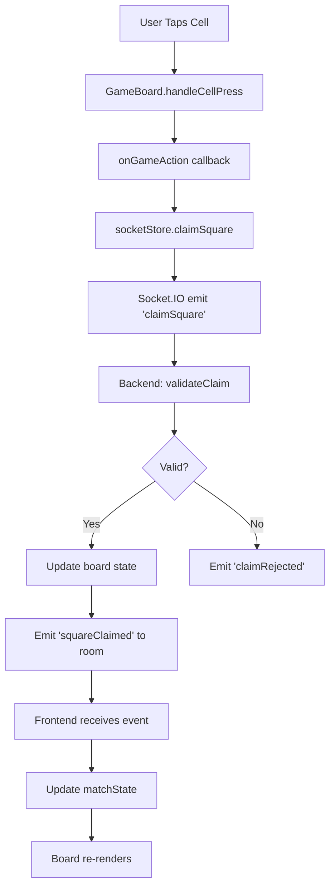

# Code Refactoring Report - Game of Strife v1.0.0

**Generated:** 2026-01-09
**Status:** Pre-v1 Beta Release Analysis
**Scope:** Frontend (React Native) and Backend (Node.js/Fastify)

---

## Executive Summary

The codebase is **production-ready** for v1 beta release. All features work correctly, multiplayer is stable, and the code is well-documented. However, there are opportunities to improve **maintainability**, **type safety**, and **performance** for future iterations.

**Recommendation:** Ship v1 beta as-is, then implement improvements incrementally in v1.1+

---

## Priority Levels

- 🔴 **HIGH**: Significant impact on maintainability or performance
- 🟡 **MEDIUM**: Moderate improvement, good for v1.1
- 🟢 **LOW**: Nice-to-have, low risk

---

## 1. Type Safety Improvements

### 🟡 MEDIUM: Strengthen TypeScript Types

**Current State:**
- Some `any` types in critical paths
- Optional chaining used where types could be stricter
- Union types could be more specific

**Examples:**

**GameBoard.tsx:39**
```typescript
// Current
onGameAction: (action: any) => void;

// Recommended
type GameAction =
  | { type: 'PLACE_TOKEN'; payload: { position: number; row: number; col: number }; timestamp: number }
  | { type: 'REMOVE_TOKEN'; payload: { position: number }; timestamp: number }

onGameAction: (action: GameAction) => void;
```

**GameHUD.tsx:18,25,42**
```typescript
// Current
matchState?: any;
settings?: any;

// Recommended
import { MatchState } from '../stores/socketStore';
import { GameSettings } from '../stores/settingsStore';

matchState?: MatchState;
settings?: GameSettings;
```

**Benefits:**
- Better autocomplete in IDE
- Catch errors at compile time
- Self-documenting code

**Estimated Effort:** 2-3 hours
**Risk:** Low (purely additive)

---

### 🟢 LOW: Extract Magic Numbers to Constants

**Current State:**
- Hardcoded numbers scattered throughout code
- Difficult to tune values consistently

**Examples:**

**GameBoard.tsx**
```typescript
// Current - scattered magic numbers
const BOARD_BORDER = 2;
const cellBorderWidth = 0.5;
if (boardSize <= 20) { /* animations */ }

// Recommended - centralized constants file
// constants/board.ts
export const BOARD_CONSTANTS = {
  BORDER_WIDTH: 2,
  CELL_BORDER_WIDTH: 0.5,
  ANIMATION_BOARD_SIZE_LIMIT: 20,
  MAX_GENERATIONS: 100,
  TABLET_BREAKPOINT: 600,
} as const;
```

**GameOfStrife.tsx**
```typescript
// Current
const generationDelay = 200; // Hardcoded
if (generationsRef.current.length >= 100) // Magic number

// Recommended
import { SIMULATION_CONSTANTS } from '../constants/simulation';

const generationDelay = SIMULATION_CONSTANTS.GENERATION_DELAY_MS;
if (generationsRef.current.length >= SIMULATION_CONSTANTS.MAX_GENERATIONS)
```

**Benefits:**
- Single source of truth for tuning
- Easier to adjust game balance
- Self-documenting intent

**Estimated Effort:** 1 hour
**Risk:** Very Low

---

## 2. Component Architecture

### 🔴 HIGH: Extract Complex Logic from Components

**Current State:**
- GameBoard.tsx is 754 lines (too large)
- GameOfStrife.tsx has complex simulation logic mixed with UI
- socketStore.ts is 800+ lines

**Recommended Refactorings:**

#### A. Extract Animation Logic

**Current:** Animation system in GameBoard.tsx (lines 88-148, 321-465)

**Recommended Structure:**
```
hooks/
  useSuperpowerAnimations.ts  // Animation creation and lifecycle
  useBoardGestures.ts         // Touch handling and drag logic
  useBoardLayout.ts           // Layout measurement and calculations
utils/
  animationConfigs.ts         // Animation timing configurations
  bresenhamLine.ts            // Line interpolation algorithm
```

**Example Extraction:**
```typescript
// hooks/useSuperpowerAnimations.ts
export function useSuperpowerAnimations(
  stage: GameStage,
  enableAnimations: boolean,
  boardSize: number
) {
  const animatedValues = useRef({ /* ... */ }).current;

  useEffect(() => {
    // Animation lifecycle logic
  }, [stage, enableAnimations, boardSize]);

  const getAnimatedStyle = useCallback((cell: Cell) => {
    // Animation style generation
  }, [animatedValues]);

  return { animatedValues, getAnimatedStyle };
}

// GameBoard.tsx - simplified
const { animatedValues, getAnimatedStyle } = useSuperpowerAnimations(
  stage,
  enableSuperpowerAnimations,
  boardSize
);
```

**Benefits:**
- GameBoard.tsx reduced to ~400 lines
- Reusable animation logic
- Easier to test in isolation
- Better separation of concerns

**Estimated Effort:** 4-6 hours
**Risk:** Medium (requires careful testing)

---

#### B. Extract Conway Simulation Logic

**Current:** Simulation in GameOfStrife.tsx (lines 141-254)

**Recommended:**
```typescript
// hooks/useConwaySimulation.ts
export function useConwaySimulation(
  initialBoard: Cell[][],
  settings: GameSettings,
  stage: GameStage
) {
  const [generation, setGeneration] = useState(0);
  const [isRunning, setIsRunning] = useState(false);
  const generationsRef = useRef<Cell[][][]>([]);

  const runSimulation = useCallback(() => {
    // Simulation logic
  }, [initialBoard, settings]);

  const stopSimulation = useCallback(() => {
    // Stop logic
  }, []);

  return {
    generation,
    generations: generationsRef.current,
    isRunning,
    runSimulation,
    stopSimulation,
    duration: simulationDuration,
  };
}
```

**Benefits:**
- GameOfStrife.tsx reduced to ~200 lines (UI only)
- Simulation logic can be unit tested
- Could be reused in replay feature
- Clearer component responsibilities

**Estimated Effort:** 3-4 hours
**Risk:** Medium (needs thorough testing)

---

### 🟡 MEDIUM: Split Large Store Files

**Current State:**
- socketStore.ts is 800+ lines with multiple responsibilities

**Recommended Structure:**
```
stores/
  socket/
    connectionStore.ts    // Socket connection state
    roomStore.ts          // Room management
    matchStore.ts         // Match state and game actions
    index.ts              // Combined exports
```

**Example:**
```typescript
// stores/socket/connectionStore.ts
interface ConnectionStore {
  socket: Socket | null;
  isConnected: boolean;
  connectionStatus: 'connecting' | 'connected' | 'disconnected' | 'error';
  connect: () => void;
  disconnect: () => void;
}

export const useConnectionStore = create<ConnectionStore>(/* ... */);

// stores/socket/matchStore.ts
interface MatchStore {
  matchState: MatchState | null;
  pendingClaims: Map<string, PendingClaim>;
  claimSquare: (squareId: number, superpowerType?: number) => void;
  // ... other match actions
}

export const useMatchStore = create<MatchStore>(/* ... */);

// stores/socket/index.ts
export { useConnectionStore } from './connectionStore';
export { useRoomStore } from './roomStore';
export { useMatchStore } from './matchStore';

// Usage in components stays the same (barrel export)
import { useMatchStore } from '../stores/socket';
```

**Benefits:**
- Easier to find specific functionality
- Smaller files are easier to understand
- Could enable code splitting in future
- Better git diff clarity (changes are more isolated)

**Estimated Effort:** 3-4 hours
**Risk:** Medium (need to ensure state interactions still work)

---

## 3. Code Duplication & Reusability

### 🟡 MEDIUM: Extract Color/Style Utilities

**Current State:**
- Color logic duplicated across components
- Style calculations repeated

**Examples:**

**GameBoard.tsx (lines 467-515)**
```typescript
// Current - inline style logic
const getCellStyle = (cell: Cell) => {
  const cellStyles: any[] = [styles.cell];

  if (cell.alive && cell.player === 0) {
    cellStyles.push(styles.cellP1);
  } else if (cell.alive && cell.player === 1) {
    cellStyles.push(styles.cellP2);
  }
  // ... more logic
}
```

**Recommended:**
```typescript
// utils/cellStyles.ts
export const getCellPlayerStyle = (cell: Cell) => {
  if (!cell.alive) return 'cellEmpty';
  return cell.player === 0 ? 'cellP1' : 'cellP2';
};

export const getCellSuperpowerStyle = (superpowerType: number) => {
  const styleMap = {
    1: 'superpowerTank',
    2: 'superpowerSpreader',
    // ...
  };
  return styleMap[superpowerType] || null;
};

export const getCellMemoryStyle = (memory: number) => {
  if (memory & MEMORY_FLAGS.IS_VETERAN) return 'cellVeteran';
  return null;
};

// GameBoard.tsx - cleaner
const cellStyles = [
  styles.cell,
  styles[getCellPlayerStyle(cell)],
  cell.superpowerType > 0 && styles[getCellSuperpowerStyle(cell.superpowerType)],
  getCellMemoryStyle(cell.memory) && styles.cellVeteran,
].filter(Boolean);
```

**Benefits:**
- Reusable across components
- Easier to add new cell types
- Testable in isolation
- Clearer intent

**Estimated Effort:** 2 hours
**Risk:** Low

---

### 🟢 LOW: Create Shared Hooks for Common Patterns

**Examples:**

```typescript
// hooks/useDebounce.ts - for search/filter inputs
export function useDebounce<T>(value: T, delay: number): T {
  const [debouncedValue, setDebouncedValue] = useState(value);

  useEffect(() => {
    const handler = setTimeout(() => setDebouncedValue(value), delay);
    return () => clearTimeout(handler);
  }, [value, delay]);

  return debouncedValue;
}

// hooks/useInterval.ts - for simulation timing
export function useInterval(callback: () => void, delay: number | null) {
  const savedCallback = useRef(callback);

  useEffect(() => {
    savedCallback.current = callback;
  }, [callback]);

  useEffect(() => {
    if (delay === null) return;

    const id = setInterval(() => savedCallback.current(), delay);
    return () => clearInterval(id);
  }, [delay]);
}

// Usage in GameOfStrife.tsx
useInterval(() => {
  advanceGeneration();
}, isSimulating ? animationSpeed : null);
```

**Benefits:**
- Consistent patterns across codebase
- Well-tested implementations
- Less boilerplate

**Estimated Effort:** 1-2 hours
**Risk:** Very Low

---

## 4. Performance Optimizations

### 🟡 MEDIUM: Memoize Expensive Calculations

**Current State:**
- Some heavy calculations run on every render
- Board size calculations could be memoized better

**Examples:**

**GameBoard.tsx (lines 517-573)**
```typescript
// Current - recalculates on every render
const boardDimension = React.useMemo(() => {
  // Complex calculation
}, [width, height, insets, isTablet]);

// These depend on boardDimension but aren't memoized
const cellSize = Math.floor(exactCellSize);
const finalCellSize = shouldIncrementCellSize ? cellSize + 1 : cellSize;

// Recommended - memoize dependent calculations
const { boardDimension, cellSize, actualBoardWidth } = React.useMemo(() => {
  // Calculate all related values together
  const dimension = /* ... */;
  const size = /* ... */;
  const width = /* ... */;

  return { boardDimension: dimension, cellSize: size, actualBoardWidth: width };
}, [width, height, insets, isTablet, boardSize]);
```

**GameHUD.tsx (lines 44-52)**
```typescript
// Current - recalculates player indices every render
const myPlayerIndex = mySeat === 'P1' ? 0 : 1;
const opponentPlayerIndex = mySeat === 'P1' ? 1 : 0;

// Recommended
const { myPlayerIndex, opponentPlayerIndex } = useMemo(() => ({
  myPlayerIndex: mySeat === 'P1' ? 0 : 1,
  opponentPlayerIndex: mySeat === 'P1' ? 1 : 0,
}), [mySeat]);
```

**Benefits:**
- Reduced unnecessary recalculations
- Smoother animations
- Better battery life on mobile

**Estimated Effort:** 2-3 hours
**Risk:** Low

---

### 🔴 HIGH: Optimize Board Rendering

**Current State:**
- Every cell re-renders when board changes
- No virtualization for large boards

**Recommended:**

```typescript
// components/BoardCell.tsx - extracted cell component
const BoardCell = React.memo(({
  cell,
  cellSize,
  animatedStyle,
  onPress
}: BoardCellProps) => {
  return (
    <Animated.View style={[baseCellStyle, animatedStyle]}>
      {cell.alive && <Text style={styles.livesText}>{cell.lives}</Text>}
    </Animated.View>
  );
}, (prevProps, nextProps) => {
  // Custom comparison - only re-render if cell actually changed
  return (
    prevProps.cell.alive === nextProps.cell.alive &&
    prevProps.cell.player === nextProps.cell.player &&
    prevProps.cell.lives === nextProps.cell.lives &&
    prevProps.cell.superpowerType === nextProps.cell.superpowerType &&
    prevProps.cellSize === nextProps.cellSize
  );
});

// GameBoard.tsx - use memoized cells
{board.map((row, rowIndex) => (
  <View key={`row-${rowIndex}`} style={styles.row}>
    {row.map((cell, colIndex) => (
      <BoardCell
        key={`${rowIndex}-${colIndex}`}
        cell={cell}
        cellSize={finalCellSize}
        animatedStyle={getAnimatedStyle(cell)}
        onPress={() => handleCellPress(rowIndex, colIndex)}
      />
    ))}
  </View>
))}
```

**Benefits:**
- Only changed cells re-render during simulation
- Massive performance improvement for large boards (15x15)
- Smoother animations
- Could enable boards > 15x15 in future

**Estimated Effort:** 4-5 hours
**Risk:** Medium (needs careful testing)

---

## 5. Error Handling & Resilience

### 🔴 HIGH: Add Error Boundaries

**Current State:**
- No error boundaries - one component crash kills entire app
- No graceful degradation

**Recommended:**

```typescript
// components/ErrorBoundary.tsx
class ErrorBoundary extends React.Component<
  { children: React.ReactNode; fallback?: React.ReactNode },
  { hasError: boolean; error: Error | null }
> {
  constructor(props: any) {
    super(props);
    this.state = { hasError: false, error: null };
  }

  static getDerivedStateFromError(error: Error) {
    return { hasError: true, error };
  }

  componentDidCatch(error: Error, errorInfo: React.ErrorInfo) {
    logger.error('Component error:', error, errorInfo);
    // Could send to error tracking service
  }

  render() {
    if (this.state.hasError) {
      return this.props.fallback || (
        <View style={styles.errorContainer}>
          <Text style={styles.errorText}>Something went wrong</Text>
          <Button onPress={() => this.setState({ hasError: false })}>
            Try Again
          </Button>
        </View>
      );
    }

    return this.props.children;
  }
}

// app/_layout.tsx - wrap entire app
<ErrorBoundary>
  <Stack>
    {/* routes */}
  </Stack>
</ErrorBoundary>

// Individual screens can have their own boundaries too
<ErrorBoundary fallback={<GameErrorScreen />}>
  <GameOfStrife />
</ErrorBoundary>
```

**Benefits:**
- App doesn't crash entirely
- Better user experience
- Error reporting capability
- Production-ready error handling

**Estimated Effort:** 2-3 hours
**Risk:** Low

---

### 🟡 MEDIUM: Improve Network Error Handling

**Current State:**
- Socket disconnects handled but could be more robust
- No retry logic for failed moves
- No offline detection

**Recommended:**

```typescript
// stores/socket/connectionStore.ts
interface ConnectionStore {
  // ... existing
  reconnectAttempts: number;
  maxReconnectAttempts: number;
  isOffline: boolean;

  reconnectWithBackoff: () => void;
}

const useConnectionStore = create<ConnectionStore>((set, get) => ({
  maxReconnectAttempts: 5,
  reconnectAttempts: 0,
  isOffline: false,

  reconnectWithBackoff: () => {
    const { reconnectAttempts, maxReconnectAttempts } = get();

    if (reconnectAttempts >= maxReconnectAttempts) {
      set({ isOffline: true });
      return;
    }

    // Exponential backoff: 1s, 2s, 4s, 8s, 16s
    const delay = Math.min(1000 * Math.pow(2, reconnectAttempts), 16000);

    setTimeout(() => {
      get().connect();
      set({ reconnectAttempts: reconnectAttempts + 1 });
    }, delay);
  },
}));

// Add network state listener
NetInfo.addEventListener(state => {
  if (state.isConnected) {
    useConnectionStore.getState().connect();
  } else {
    useConnectionStore.setState({ isOffline: true });
  }
});
```

**Benefits:**
- Better handling of poor network conditions
- User knows when offline
- Automatic recovery
- Better mobile UX

**Estimated Effort:** 3-4 hours
**Risk:** Medium

---

## 6. Testing Infrastructure

### 🔴 HIGH: Add Unit Tests for Critical Logic

**Current State:**
- No automated tests
- Manual testing only
- Refactoring is risky

**Recommended Test Coverage:**

```typescript
// __tests__/utils/bresenhamLine.test.ts
describe('interpolateCells', () => {
  it('should return straight line horizontal', () => {
    const result = interpolateCells(
      { row: 0, col: 0 },
      { row: 0, col: 3 }
    );
    expect(result).toEqual([
      { row: 0, col: 0 },
      { row: 0, col: 1 },
      { row: 0, col: 2 },
      { row: 0, col: 3 },
    ]);
  });

  it('should return diagonal line', () => {
    const result = interpolateCells(
      { row: 0, col: 0 },
      { row: 2, col: 2 }
    );
    expect(result).toEqual([
      { row: 0, col: 0 },
      { row: 1, col: 1 },
      { row: 2, col: 2 },
    ]);
  });
});

// __tests__/engine/gameOfStrifeEngine.test.ts
describe('GameOfStrifeEngine', () => {
  it('should initialize with default settings', () => {
    const engine = new GameOfStrifeEngine();
    const state = engine.createInitialState(['P1', 'P2']);
    expect(state.board).toHaveLength(10);
  });

  it('should validate token placement correctly', () => {
    const engine = new GameOfStrifeEngine();
    const state = engine.createInitialState(['P1', 'P2']);

    const result = engine.validateClaim(state, 'P1', 0, 0);
    expect(result.valid).toBe(true);
  });

  it('should reject placement on occupied cell', () => {
    // ... test
  });
});

// __tests__/hooks/useSuperpowerAnimations.test.ts
describe('useSuperpowerAnimations', () => {
  it('should start animations on placement stage', () => {
    // ... test with renderHook from @testing-library/react-hooks
  });
});
```

**Recommended Testing Setup:**
- **Jest** for test runner
- **@testing-library/react-native** for component tests
- **@testing-library/react-hooks** for custom hooks
- **MSW (Mock Service Worker)** for socket mocking

**Benefits:**
- Confidence in refactoring
- Catch regressions early
- Documentation via tests
- Faster development (less manual testing)

**Estimated Effort:** 8-12 hours for initial setup + key tests
**Risk:** Low (additive only)

---

## 7. Code Organization & Structure

### 🟡 MEDIUM: Consistent File Naming

**Current State:**
- Mixed naming conventions
- Some files use PascalCase, others camelCase

**Current Structure:**
```
components/
  GameBoard.tsx          # PascalCase
  GameOfStrife.tsx       # PascalCase
  GameHUD.tsx            # PascalCase ✅

stores/
  socketStore.ts         # camelCase
  settingsStore.ts       # camelCase

utils/
  colors.ts              # camelCase
  gameTypes.ts           # camelCase
```

**Recommended Standard:**
```
components/
  GameBoard/
    GameBoard.tsx        # Component file
    GameBoard.styles.ts  # Styles (if large)
    index.ts             # Barrel export

hooks/
  useSuperpowerAnimations.ts  # camelCase for hooks
  useBoardGestures.ts

utils/
  bresenhamLine.ts       # camelCase for utilities
  cellStyles.ts

stores/
  socketStore.ts         # camelCase for stores
  settingsStore.ts
```

**Benefits:**
- Consistent conventions
- Easier to navigate
- Better code organization
- Prepared for potential component library extraction

**Estimated Effort:** 1-2 hours
**Risk:** Low (mostly file moves)

---

### 🟢 LOW: Add Barrel Exports

**Current State:**
- Long import paths
- Tedious to import multiple items

**Current:**
```typescript
import { useSocketStore } from '../stores/socketStore';
import { useSettingsStore } from '../stores/settingsStore';
import { GameSettings } from '../stores/settingsStore';
import { Cell, MEMORY_FLAGS } from '../utils/gameTypes';
```

**Recommended:**
```typescript
// stores/index.ts
export * from './socketStore';
export * from './settingsStore';

// utils/index.ts
export * from './gameTypes';
export * from './colors';
export * from './devMode';

// Usage
import { useSocketStore, useSettingsStore, GameSettings } from '../stores';
import { Cell, MEMORY_FLAGS } from '../utils';
```

**Benefits:**
- Cleaner imports
- Easier refactoring (internal structure can change)
- Better developer experience

**Estimated Effort:** 30 minutes
**Risk:** Very Low

---

## 8. Modern JavaScript/TypeScript Practices

### 🟡 MEDIUM: Use Object Destructuring More Consistently

**Examples:**

```typescript
// Current
const myPlayerIndex = mySeat === 'P1' ? 0 : 1;
const myTokens = mySeat === 'P1' ? playerTokens.player0 : playerTokens.player1;
const myLivingCells = countLivingCells(board, myPlayerIndex);

// Recommended
const { player0, player1 } = playerTokens;
const myPlayerIndex = mySeat === 'P1' ? 0 : 1;
const myTokens = mySeat === 'P1' ? player0 : player1;
const myLivingCells = countLivingCells(board, myPlayerIndex);
```

**Benefits:**
- More concise
- Clearer intent
- Modern JavaScript style

---

### 🟢 LOW: Use Optional Chaining Consistently

**Examples:**

```typescript
// Current
if (matchState && matchState.winner) { }

// Recommended
if (matchState?.winner) { }

// Current
const winner = matchState ? matchState.winner : null;

// Recommended
const winner = matchState?.winner ?? null;
```

---

### 🟢 LOW: Use Template Literals for String Building

**Examples:**

```typescript
// Current
'Match: ' + matchState.id?.split('_').pop()

// Recommended
`Match: ${matchState.id?.split('_').pop()}`

// Current
console.log('[GameBoard] Cell pressed:', { row, col });

// Recommended
console.log(`[GameBoard] Cell pressed: row=${row}, col=${col}`);
```

---

## 9. Backend Improvements

### 🟡 MEDIUM: Add Input Validation Layer

**Current State:**
- Basic validation in engine
- Could be more comprehensive

**Recommended:**

```typescript
// server/src/validation/schemas.ts
import { z } from 'zod';

export const gameSettingsSchema = z.object({
  boardSize: z.number().min(5).max(15),
  tokensPerPlayer: z.number().min(1).max(100),
  birthRules: z.array(z.number().min(0).max(8)),
  survivalRules: z.array(z.number().min(0).max(8)),
  enabledSuperpowers: z.array(z.number().min(1).max(7)),
  superpowerPercentage: z.number().min(0).max(50),
  enableToroidalBoard: z.boolean(),
});

export const claimSquareSchema = z.object({
  squareId: z.number().min(0),
  superpowerType: z.number().min(0).max(7).optional(),
  selectionId: z.string().uuid(),
});

// server/src/handlers/claimSquare.ts
socket.on('claimSquare', (data) => {
  try {
    const validated = claimSquareSchema.parse(data);
    // Process claim
  } catch (error) {
    if (error instanceof z.ZodError) {
      socket.emit('error', { message: 'Invalid input', errors: error.errors });
    }
  }
});
```

**Benefits:**
- Prevents invalid data from reaching engine
- Better error messages
- Type-safe validation
- Runtime type checking

**Estimated Effort:** 2-3 hours
**Risk:** Low

---

### 🟢 LOW: Add Request Rate Limiting

**Recommended:**

```typescript
// server/src/middleware/rateLimiter.ts
import rateLimit from '@fastify/rate-limit';

await fastify.register(rateLimit, {
  max: 100, // 100 requests
  timeWindow: '1 minute',
  cache: 10000,
  allowList: ['127.0.0.1'], // Localhost exempt
  redis: redis, // Optional: use Redis for distributed rate limiting
});

// Per-socket rate limiting
const socketRateLimiter = new Map<string, { count: number; resetAt: number }>();

socket.on('claimSquare', (data) => {
  const now = Date.now();
  const limit = socketRateLimiter.get(socket.id);

  if (limit && limit.resetAt > now) {
    if (limit.count >= 10) { // Max 10 claims per second
      socket.emit('error', { message: 'Rate limit exceeded' });
      return;
    }
    limit.count++;
  } else {
    socketRateLimiter.set(socket.id, { count: 1, resetAt: now + 1000 });
  }

  // Process claim
});
```

**Benefits:**
- Prevents abuse
- Protects server resources
- Better production readiness

**Estimated Effort:** 1-2 hours
**Risk:** Low

---

## 10. Documentation Improvements

### 🟢 LOW: Add Architecture Diagrams

**Recommended:**

Create visual diagrams for:
1. **Data Flow Diagram** - How data moves from user action → frontend → websocket → backend → database
2. **Component Hierarchy** - Tree view of React components
3. **State Management** - How Zustand stores interact
4. **Game Flow** - FSM diagram of game states (waiting → placement → simulation → finished)

**Tools:** Mermaid.js (works in GitHub markdown)

**Example:**


**Estimated Effort:** 2-3 hours
**Risk:** None (documentation only)

---

## Implementation Roadmap

### Phase 1: Ship v1.0.0 Beta (NOW)
- ✅ Current codebase is ready
- ✅ All features working
- ✅ Code documented

### Phase 2: Quick Wins (v1.1.0 - 1 week)
- 🟢 Extract magic numbers to constants
- 🟢 Add barrel exports
- 🟢 Consistent destructuring/template literals
- 🔴 Add error boundaries
- Total: ~6-8 hours

### Phase 3: Safety & Quality (v1.2.0 - 2 weeks)
- 🔴 Add unit tests for critical logic
- 🟡 Strengthen TypeScript types
- 🟡 Add input validation (backend)
- Total: ~15-20 hours

### Phase 4: Performance (v1.3.0 - 2 weeks)
- 🔴 Optimize board rendering (memoization)
- 🟡 Extract animation logic to hooks
- 🟡 Extract simulation logic to hooks
- Total: ~12-16 hours

### Phase 5: Architecture (v2.0.0 - 3-4 weeks)
- 🔴 Extract complex logic from components
- 🟡 Split large store files
- 🟡 Consistent file naming
- 🟡 Improve network error handling
- Total: ~20-30 hours

---

## Conclusion

**Current State:** Production-ready for v1 beta release

**Top 3 Priority Improvements for v1.1:**
1. 🔴 **Error Boundaries** - Prevent crashes (2-3 hours, low risk)
2. 🔴 **Unit Tests** - Safety net for future changes (8-12 hours, low risk)
3. 🟡 **TypeScript Improvements** - Better developer experience (2-3 hours, low risk)

**Long-term Goals:**
- Extract complex logic into custom hooks
- Optimize rendering performance
- Add comprehensive test coverage
- Improve error handling and resilience

**Total Estimated Effort for All Improvements:** 60-80 hours

**Recommendation:**
Ship v1 beta now, gather user feedback, then implement improvements incrementally based on actual usage patterns and pain points discovered during beta testing.
